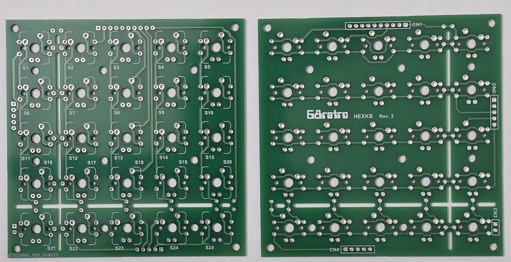
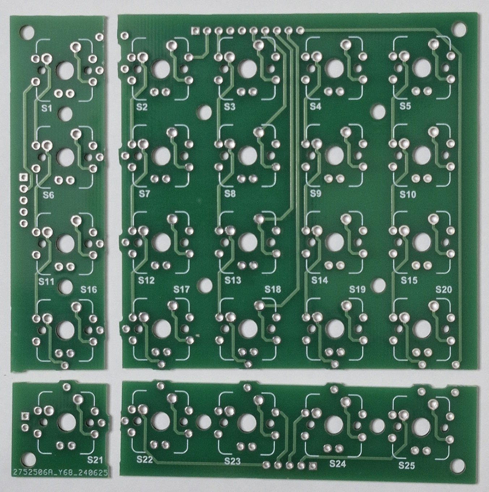
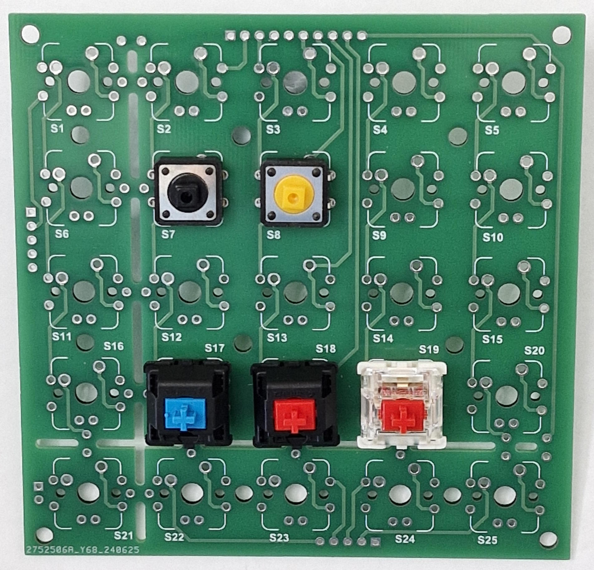
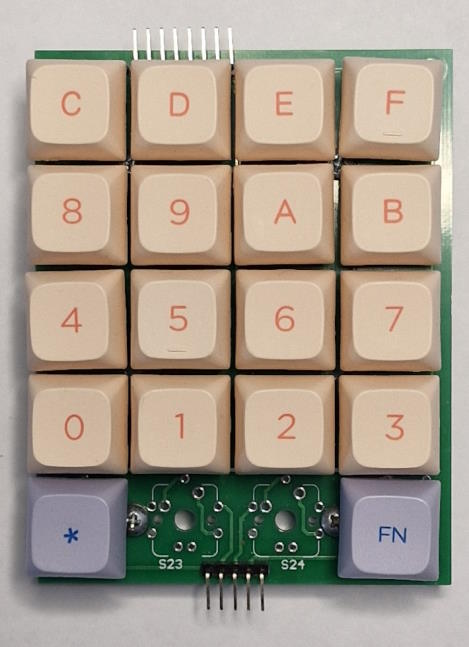
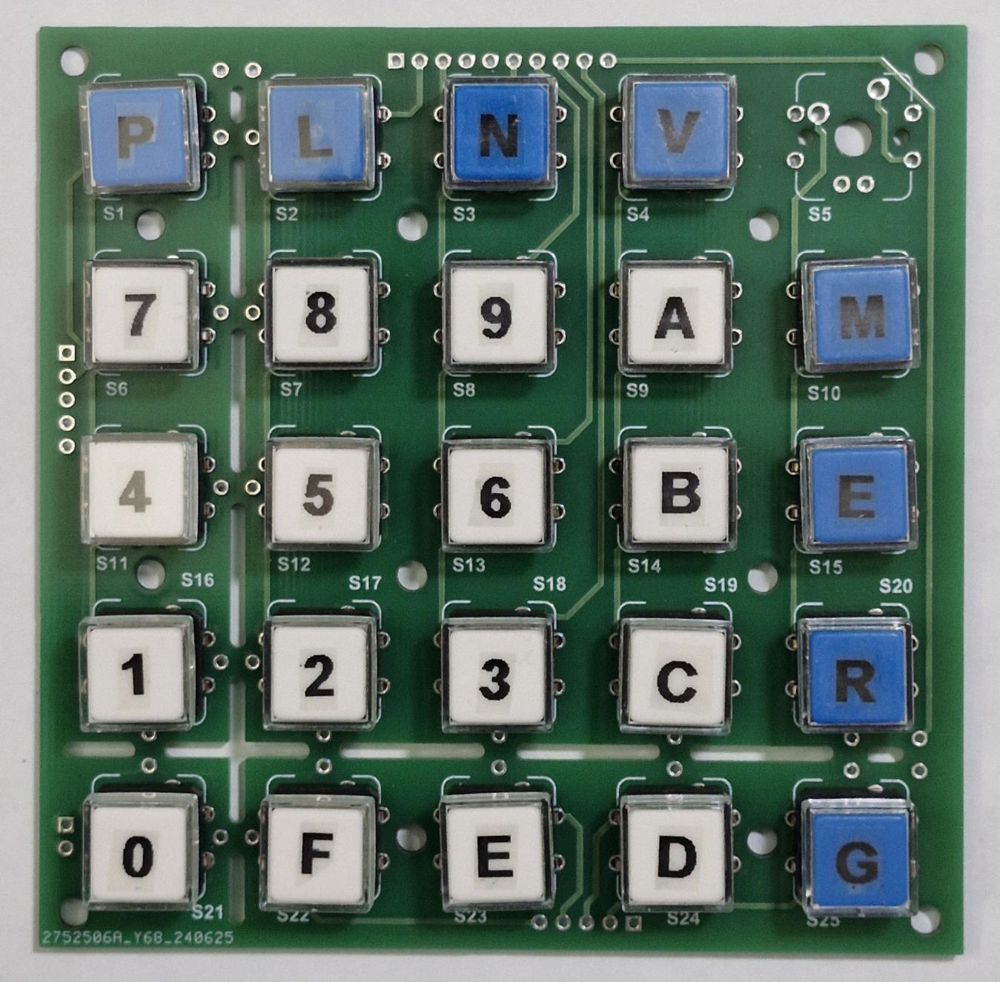

## 68retro Hex Keyboard

This 'adjustable' PCB can be used as a 5x5,4x5,5x4 and 4x4 matrix keyboard by cutting off the appropriate sides.
The excess can also be used as a pair of 1x4's and a single key (perhaps not that useful).

It takes 12mm tactile pushbuttons, Cherry MX and compatible keys.

So far I have used it as a DREAM6800 keyboard, and a MEK6800D2 keyboard;

